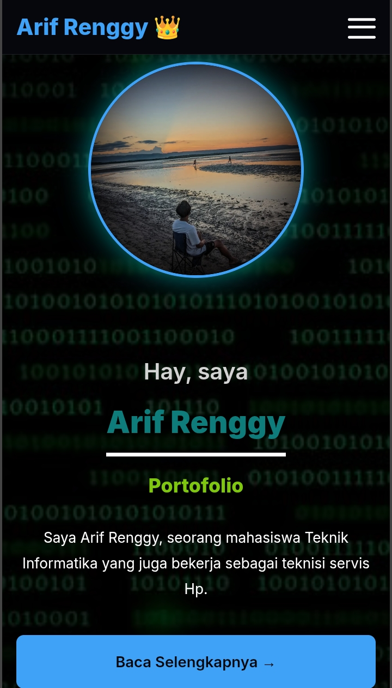
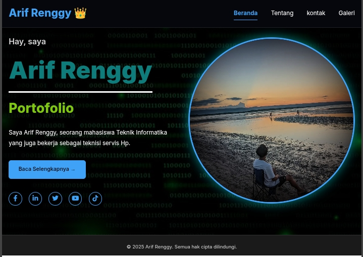

# 🌐 My Portfolio Website

> Dibuat dengan semangat belajar dan kreativitas 💪

## 🛠️ Teknologi yang Digunakan

- 🔹 **HTML5**  
- 🔹 **CSS3**  
(Tanpa framework, tanpa JavaScript. Pure clean coding!)

## 📄 Deskripsi Singkat

Ini adalah proyek portofolio sederhana yang saya buat sebagai bagian dari tugas kuliah.  
Tujuannya adalah untuk memahami struktur dasar halaman web, mulai dari elemen HTML hingga styling dengan CSS.

## 🎯 Fitur Utama

- Halaman profil sederhana  
- Navigasi antar halaman  
- Desain responsif tampilan PC dan Mobile 
- Tampilan bersih dan rapi

## 🚀 Live Demo

👉 [Lihat Websitenya](https://arifrenggy.vercel.app)

## 📸 Screenshot

### 📱 Tampilan Versi Mobile


### 📄 Tampilan Versi PC


## 📁 Struktur Folder

```plaintext
/
├── index.html
├── tentang.html
├── galeri.html
├── kontak.html
├── css/
│   └── styles.css
├── img/
│   ├── home.png
│   ├── mobile.png
│   └── tentang.png
└── README.md
